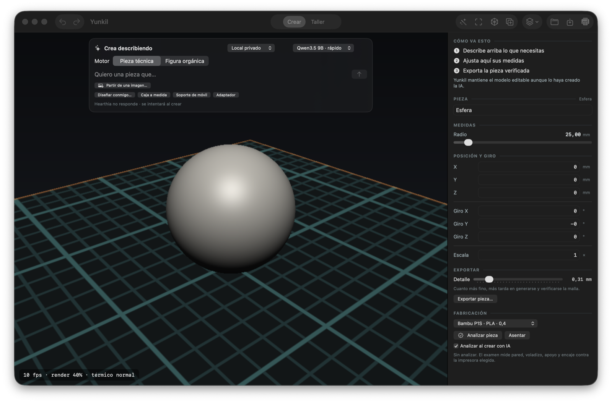
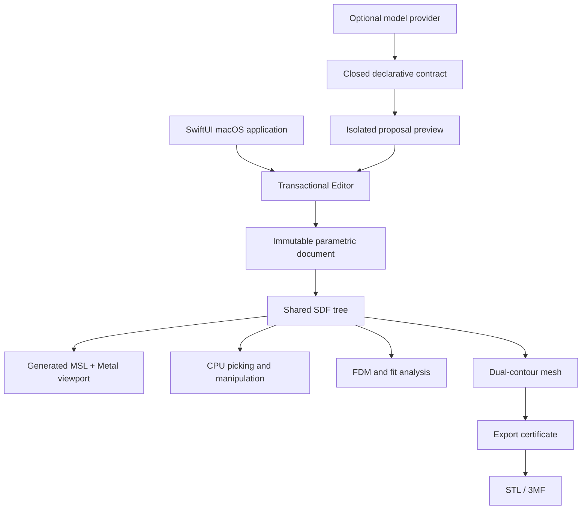

<p align="center">
  
</p>

<h1 align="center">Yunkil</h1>

<p align="center"><strong>Parametric solid modeling where real-world fit stays attached to the design.</strong></p>

<p align="center">
  A native macOS modeler for 3D printing, built on a shared SDF representation<br>
  for editing, Metal rendering, manufacturing analysis and certified export.
</p>

<p align="center">
  <a href="https://github.com/JesusMonjeGonzalez/yunkil/actions/workflows/ci.yml"></a>
  
  
  
  
</p>



## The Product Thesis

Most slicers receive a mesh with no design intent. A dimension such as 19.6 mm
cannot explain that it came from a measured 20 mm opening minus a material- and
printer-specific clearance.

Yunkil keeps that relationship alive:

1. Record a real measurement and its provenance.
2. Attach a fit relationship to editable geometry.
3. Re-derive dependent dimensions when the measurement or manufacturing profile changes.
4. Measure the final geometry, after booleans and later edits.
5. Refuse export when the resulting mesh cannot be certified.

## What Makes Yunkil Different

### Fit is a relationship, not a copied number

Measurements record where they came from: caliper, ruler, catalog, standard or
estimate. A fit declares direction, axis and fit class. Correcting one
measurement updates every dependent part instead of leaving stale dimensions.

### The final geometry is the evidence

Yunkil verifies fit against the compiled SDF, not only against the operation
that declared it. Added material, an obstruction or an unmeasurable cavity can
invalidate the result. Verification fails closed rather than silently approving
an unknown fit.

### One representation drives the workflow

The same parametric SDF tree feeds editing, picking, Metal raymarching,
manufacturing analysis and mesh generation. Numeric changes travel through
uniforms; topology changes regenerate the shader fingerprint.

### Export is conditional

STL and 3MF exports pass a certificate covering closure, orientation,
degenerates, self-intersections, field deviation and volume. A mesh that does
not pass is not written.

## Architecture



```text
core/       Kotlin Multiplatform geometry, document, analysis and export
apps/mac/   native SwiftUI application and Metal viewport
tools/      harnesses: CPU/Metal parity, proposal preview, camera rays, gizmo, app state
scripts/    build, install and verification entry points
docs/       detailed design, limits and implementation notes
```

## Capabilities

| Area | Current implementation |
|---|---|
| Technical modeling | Primitives, profiles, extrusion, revolution, sweep, booleans, fillet, chamfer, shell, offset, symmetry and patterns |
| Direct interaction | CPU ray picking, face manipulation, a move/rotate/scale gizmo with 1 mm and 15° snapping, sectioning, orthographic views and transactional undo/redo |
| Fit system | Provenance-aware measurements, governed dimensions, fit classes and final-geometry verification |
| Organic modeling | Semantic SDF figures, variable-radius curves, additive/subtractive and field-deformation brushes, masks and symmetry |
| Manufacturing | FDM profiles, wall/support/overhang analysis, orientation search, fit reports and a printed calibration coupon that stores a per-machine clearance |
| Import/export | STL import, `.yunkil` JSON documents, certified binary STL and 3MF export |

## Model-Assisted Workflow

Optional model providers produce JSON against a closed declarative contract.
Yunkil does not execute generated Kotlin, Swift, Python or shell commands.

Technical proposals are:

1. Parsed and validated.
2. Applied to an isolated editor.
3. Reviewed against geometric constraints.
4. Shown as an add/remove preview.
5. Applied only after explicit acceptance.

Local mode uses Hearthia on `127.0.0.1:9292`. The optional remote provider can
receive text, structured document context and user-selected reference images;
it does not receive a complete `.yunkil` file or exported STL.

## Build And Run

Requirements:

- macOS 14 or newer on Apple Silicon.
- JDK 21.
- Xcode or Command Line Tools with Swift and Metal tooling.

```bash
git clone https://github.com/JesusMonjeGonzalez/yunkil.git
cd yunkil
./scripts/construir-mac.sh debug
open build/Yunkil.app
```

Install into `/Applications` when writable, otherwise `~/Applications`:

```bash
./scripts/instalar.sh
```

## The Same Core Without A Window

`yunkil` is a native command-line binary linked against the same Kotlin core — no JVM
on the machine that runs it. It answers the question a slicer cannot: *will this part
survive this printer?*

```bash
./scripts/construir-cli.sh instalar

yunkil examinar descargado.stl --perfil "Prusa MK4 · PLA · 0,4"
yunkil exportar pieza.yunkil pieza.3mf --detalle 0.3
yunkil perfiles
```

`examinar` measures wall thickness, overhangs, unsupported material, first-layer area
and slenderness against a printer and material profile, and reports mesh topology. It
exits `1` when something will fail and `2` when the part could not be read at all, so
it works as a guard in a script or a CI step before slicing. `--json` emits the whole
report. `exportar` writes the file only when the certificate passes; given an STL it
is the flagship path — an arbitrary mesh in, a verified one out.

## Verification

```bash
./scripts/comprobar.sh
./scripts/comprobar.sh nucleo
./gradlew :core:jvmTest
```

The full local harness covers the Kotlin core, CPU/Metal geometry parity,
proposal-preview rendering, camera rays, gizmo arithmetic, the application state
layer driven without a window, and the command-line binary. GitHub CI
runs the portable JVM core suite; Metal and app behavior remain macOS-local
verification gates.

## Current Limits

- Advanced prototype without sustained external print validation.
- macOS/Apple Silicon application only; no finished iPad application.
- The app harness drives the state layer, not the SwiftUI view tree: layout and rendered controls have no automated coverage.
- No signed, notarized public release: that needs an Apple Developer account, not code.
- A passing geometry certificate is not a safety, fit or manufacturing guarantee.
- An examination costs seconds even on a small part — measured: 9 s on a 14 mm box with a
  release core — because it samples the surface at nozzle density whatever the part
  measures. It runs in the background, but it is not something to ask for on every change.

## Current Focus

1. Validate the calibrated clearance against real prints on real machines.
2. Bring the organic AI flow level with the parametric one: ghost preview, correction
   rounds, document review tied to the proposal and a log entry.
3. Direct selection and editing of organic parts, including grabbing a curve's control
   points in the viewport.

`docs/technical-overview.md` carries the full ordered list; this is its head.

## Deep Technical Documentation

The previous long-form README is preserved as the
[`technical overview`](docs/technical-overview.md). It contains detailed
invariants, algorithms, interaction notes, privacy boundaries, limitations and
the full roadmap.
